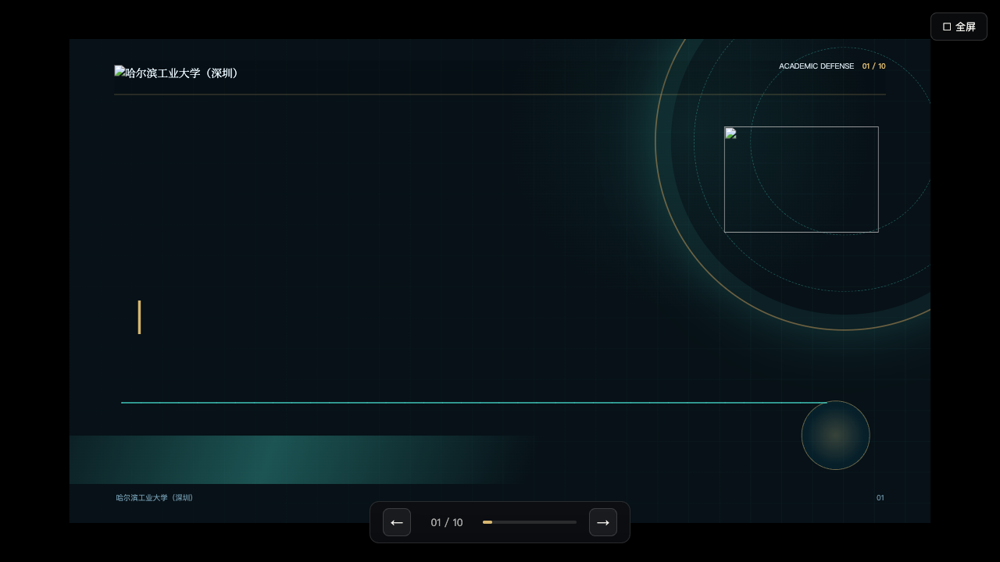
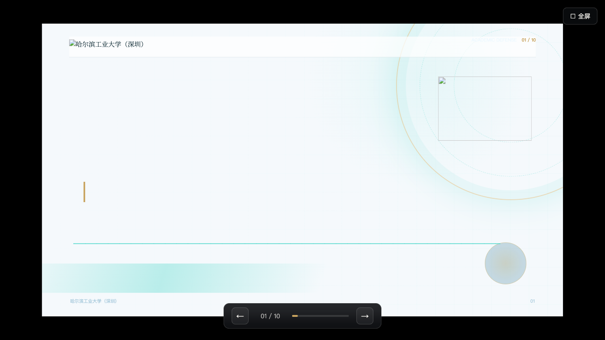
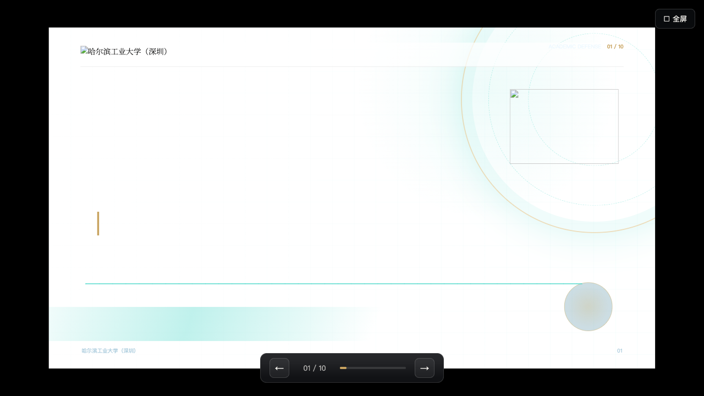
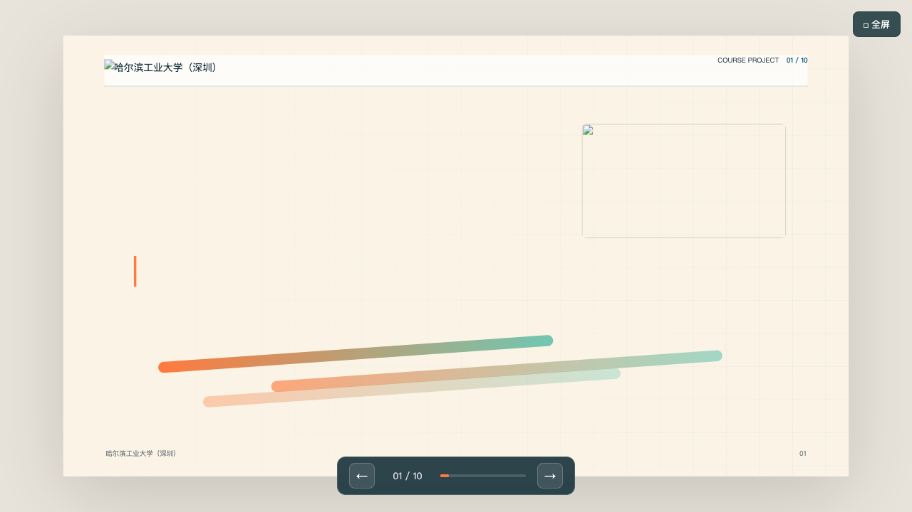
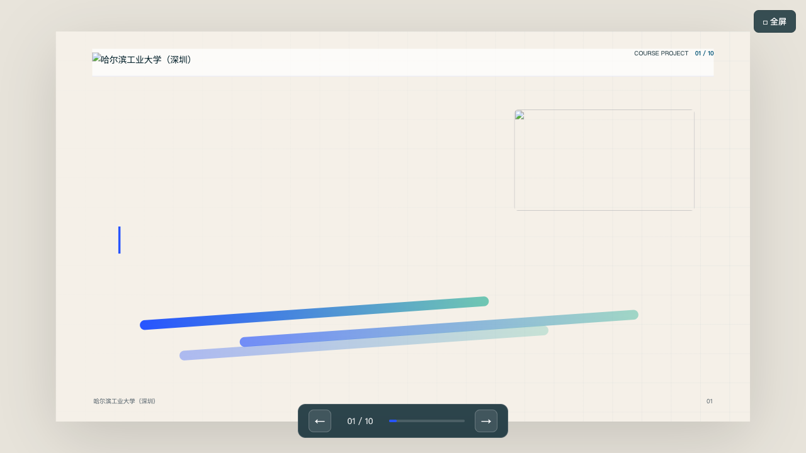
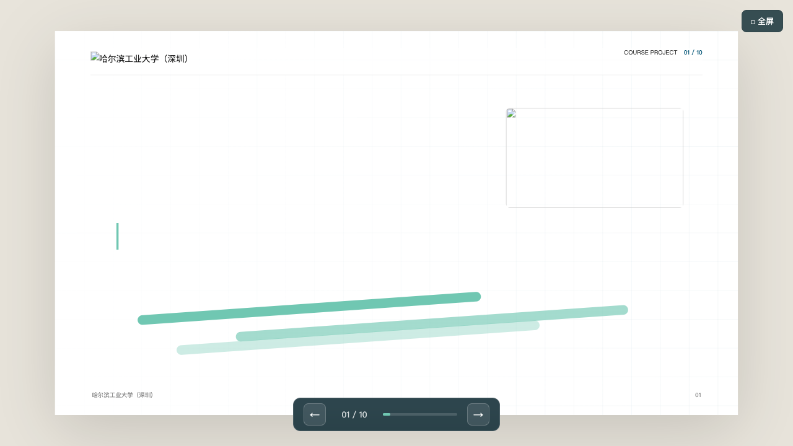
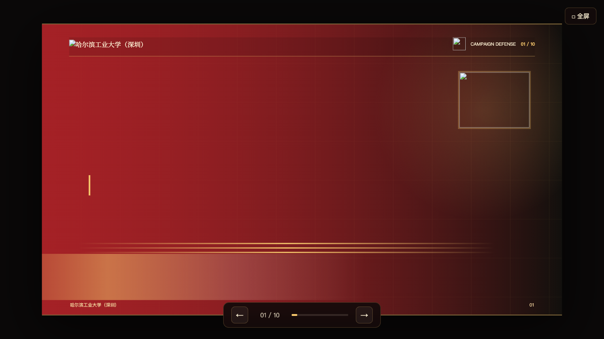
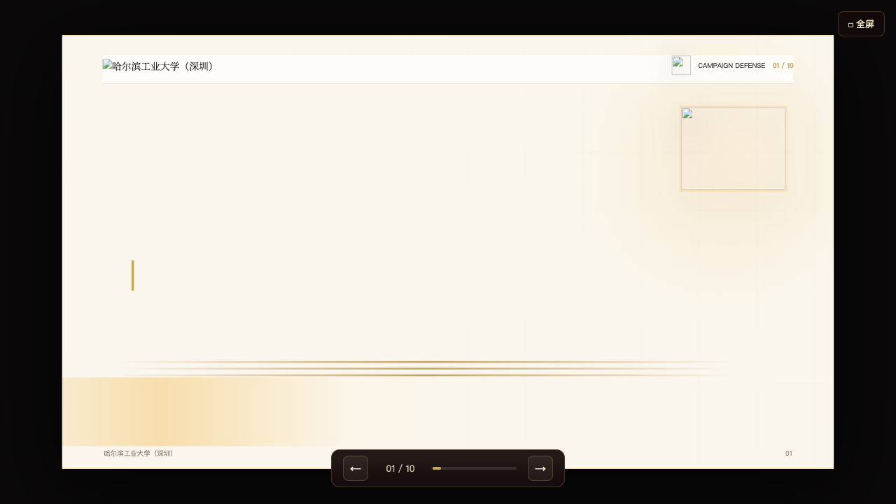
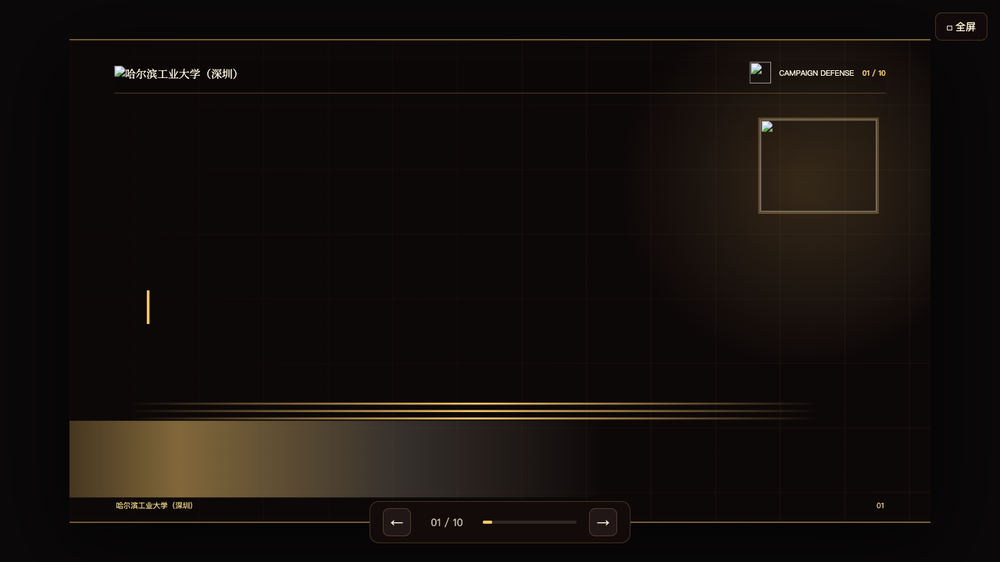

# HIT Shenzhen HTML PPT Template Library

> Pure static HTML slide templates for HIT Shenzhen students and AI-assisted presentation generation.
> Brand-compliant with HIT Visual Identity System. GSAP animations + Chart.js data visualization.

[](https://github.com/MervinShi/hit-ppt-templates)
[](./LICENSE)
[](https://www.hitsz.edu.cn)

---

## Template Previews

### Academic & Research

| [](templates/academic-tech-dark/index.html) | [](templates/academic-data-light/index.html) | [](templates/academic-minimal/index.html) |
|:--:|:--:|:--:|
| **Dark Tech Stage** | **Data Light Panel** | **Minimal Editorial** |
| [Open →](templates/academic-tech-dark/index.html) | [Open →](templates/academic-data-light/index.html) | [Open →](templates/academic-minimal/index.html) |

### Course & Group Projects

| [](templates/course-bright/index.html) | [](templates/course-capsule/index.html) | [](templates/course-modern/index.html) |
|:--:|:--:|:--:|
| **Bright Collaborative** | **Capsule Modular** | **Modern Minimal** |
| [Open →](templates/course-bright/index.html) | [Open →](templates/course-capsule/index.html) | [Open →](templates/course-modern/index.html) |

### Campaign & Election

| [](templates/campaign-red-gold/index.html) | [](templates/campaign-formal/index.html) | [](templates/campaign-manifesto/index.html) |
|:--:|:--:|:--:|
| **Classic Red & Gold** | **Formal Ivory White** | **Bold Manifesto** |
| [Open →](templates/campaign-red-gold/index.html) | [Open →](templates/campaign-formal/index.html) | [Open →](templates/campaign-manifesto/index.html) |

---

## What is this?

A collection of **9 pure static HTML slide templates** designed for HIT Shenzhen students and faculty. Each template is a self-contained HTML file — no build step, no framework, just open in your browser and present.

- **3 academic templates** — thesis defense, group meeting, conference talk
- **3 course templates** — group project, design course, competition
- **3 campaign templates** — student union election, league committee, leadership campaign

All templates follow the [HIT Visual Identity System](https://www.hit.edu.cn) standards: official colors, emblem safe zones, header lockups, and scene-appropriate styling.

---

## Quick Start

### 1. Open & Present

Open any template in your browser and navigate with keyboard:

```bash
open templates/academic-tech-dark/index.html
open templates/course-bright/index.html
open templates/campaign-red-gold/index.html
```

| Key | Action |
|-----|--------|
| ← → | Previous / Next slide |
| Home / End | First / Last slide |
| Click left/right | Navigate slides |
| Top-right button | Fullscreen |

### 2. Generate from Markdown

```bash
node scripts/generate.cjs \
  --template academic-tech-dark \
  --content examples/sample-academic.md \
  --output my-deck.html
```

Separate slides with `---` in your markdown file. See `examples/` for sample content.

### 3. React Designer

```bash
npm install
npm run dev
```

Edit templates visually with drag-and-drop, theme customization, and live preview. Changes are saved to browser localStorage.

---

## Template Details

| # | Slug | Name | Category | Scheme | Primary Color | Pages |
|---|------|------|----------|--------|---------------|-------|
| 1 | `academic-tech-dark` | Dark Tech Stage | Academic | Dark | `#005375` | 10 |
| 2 | `academic-data-light` | Data Light Panel | Academic | Light | `#005375` | 10 |
| 3 | `academic-minimal` | Minimal Editorial | Academic | Light | `#005375` | 10 |
| 4 | `course-bright` | Bright Collaborative | Course | Light | `#005375` | 10 |
| 5 | `course-capsule` | Capsule Modular | Course | Light | `#005375` | 10 |
| 6 | `course-modern` | Modern Minimal | Course | Light | `#005375` | 10 |
| 7 | `campaign-red-gold` | Classic Red & Gold | Campaign | Dark | `#A72126` | 10 |
| 8 | `campaign-formal` | Formal Ivory White | Campaign | Light | `#A72126` | 10 |
| 9 | `campaign-manifesto` | Bold Manifesto | Campaign | Dark | `#A72126` | 10 |

### Page Types

Each template includes **10 pre-built page layouts** tailored to its scenario:

- **Academic**: Cover, Agenda, Background, Framework, Data, Figure, Results, Timeline, Summary, Thanks
- **Course**: Cover, Agenda, Problem, Persona, Solution, Prototype, Feedback, Team, Timeline, Thanks
- **Campaign**: Cover, Agenda, Profile, Achievements, Pain Points, Plan, Timeline, Promise, Team, Thanks

### GSAP Animations

10 animation presets orchestrated by reading order:

| Preset | Effect | Best for |
|--------|--------|----------|
| `heroReveal` | Rise from below | Cover titles |
| `lineSweep` | Sweeping line reveal | Decorative lines |
| `scaleIn` | Scale + bounce | Emblems, images |
| `stagger` | Sequential bounce-in | Lists, timelines |
| `dataGlow` | Glow pop-in | Data metric cards |
| `parallax` | Pan + micro-zoom | Figures |
| `badgeStamp` | Press-in stamp | League emblems |
| `goldSweep` | Gold sweep | Campaign highlights |
| `chartRise` | Rise from bottom | Bar charts |
| `fadeUp` | Fade + rise | General content |

### Charts

Powered by **Chart.js 4** CDN. Supports bar, line, radar, and doughnut charts. Falls back to CSS metric cards when data is insufficient.

### Fonts

| Role | Font |
|------|------|
| Headings (Academic/Campaign) | Noto Serif SC |
| Headings (Course) | Noto Sans SC |
| Body | PingFang SC / Noto Sans SC |
| Data | JetBrains Mono |
| Manifesto | LXGW WenKai |

Loaded via Google Fonts CDN with self-hosted fallback.

---

## VIS Compliance

Strictly follows the **HIT Visual Identity System Manual**:

- **Official Blue**: `#005375` (RGB 0/83/117)
- **Ceremonial Red**: `#A72126` (RGB 167/33/38) — campaign/election only
- **Emblem safe zone**: ≥ 1/4 emblem height clearance
- **Header spec**: emblem + name lockup (left), category + league badge + page number (right)
- **Red restriction**: ceremonial/celebration contexts only
- **Decorations must not obstruct brand zones**

---

## Project Structure

```
├── templates/                  # 9 standalone HTML templates
│   ├── academic-tech-dark/
│   ├── academic-data-light/
│   ├── academic-minimal/
│   ├── course-bright/
│   ├── course-capsule/
│   ├── course-modern/
│   ├── campaign-red-gold/
│   ├── campaign-formal/
│   └── campaign-manifesto/
├── scripts/
│   ├── generate.cjs            # Markdown → HTML generator
│   ├── create-brand-assets.cjs # Brand asset creation
│   ├── apply-template-assets.cjs
│   └── generate-previews.cjs   # Preview screenshot generator
├── examples/                   # Sample markdown content
├── src/                        # React template designer
│   ├── main.jsx
│   ├── player/SlideDeck.jsx
│   ├── generator/markdownDeck.js
│   ├── templates/templates.js
│   └── core/
├── public/assets/              # Emblems, logos, backgrounds
│   ├── hit-shenzhen/           # Brand assets (5 colors × N types)
│   ├── generated/              # Generated SVG backgrounds
│   └── ppt-media/              # Presentation media resources
├── docs/previews/              # Template preview screenshots
├── skill/SKILL.md              # Installable AI skill
├── index.json                  # Template metadata index
└── package.json
```

---

## AI Agent Integration

This project includes an installable **Claude Code Skill** (`skill/SKILL.md`) that enables AI agents to:

1. Match templates to user scenarios (defense, campaign, course, etc.)
2. Plan slide content structure
3. Generate brand-compliant HTML presentations

---

## License

MIT — Harbin Institute of Technology, Shenzhen

---

<p align="center">
  <sub>Made with ❤️ at HIT Shenzhen</sub>
</p>
