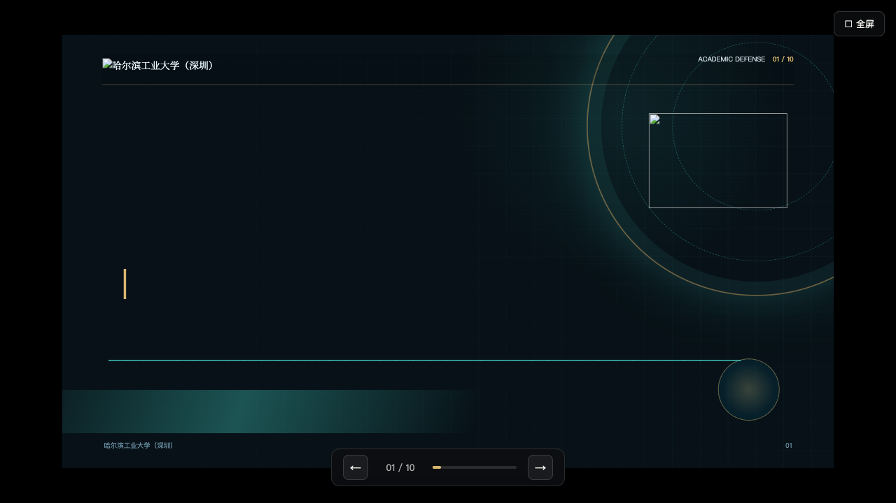
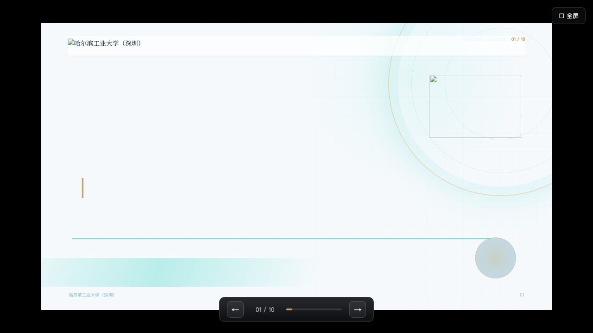
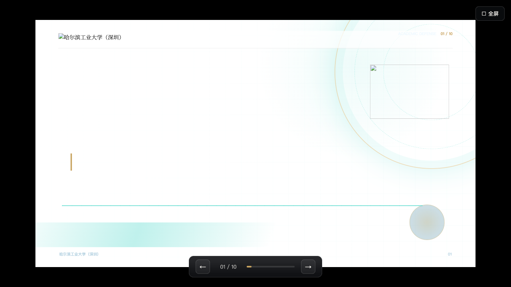
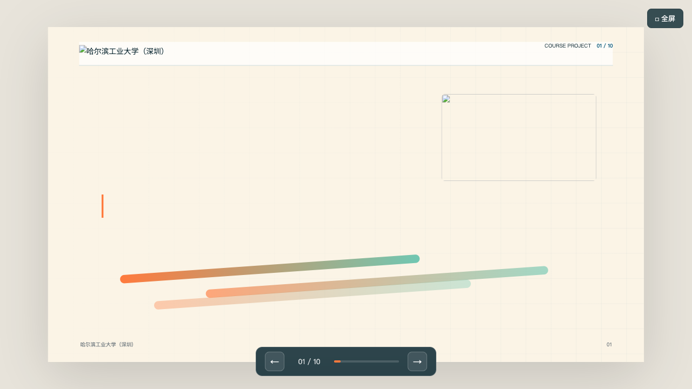
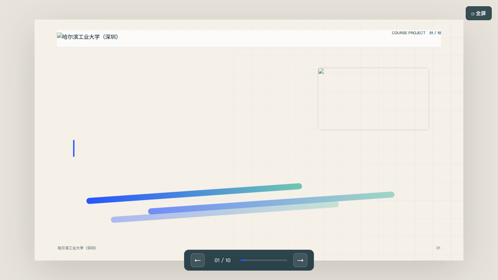
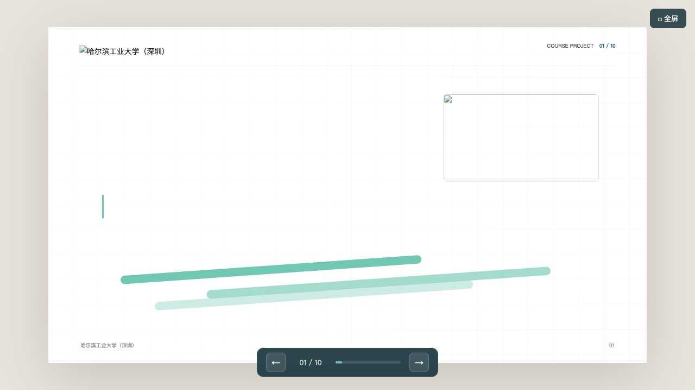
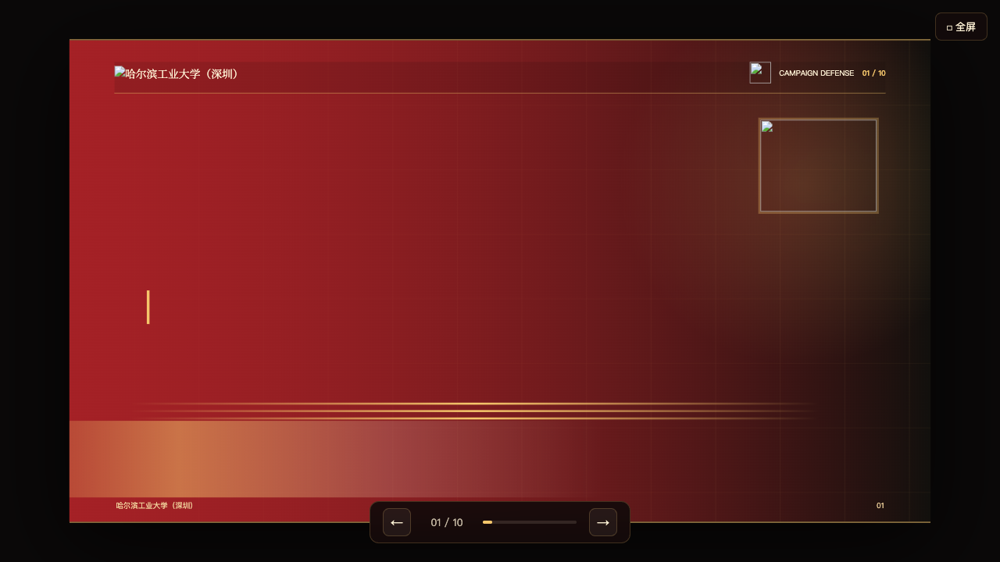
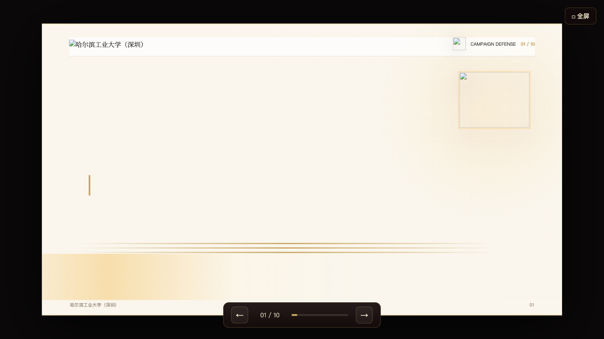
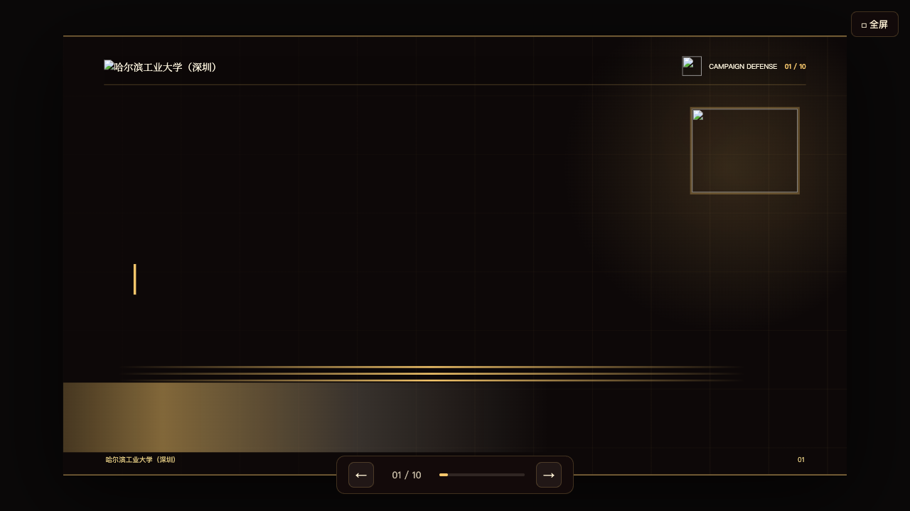

# HIT Shenzhen HTML PPT Templates

> Agent-ready HTML presentation templates for Harbin Institute of Technology, Shenzhen.
> Standalone slides, GSAP motion, Chart.js-ready data pages, HIT VIS-compliant branding, Deck JSON, and first native PPTX export.

[中文说明](./README_CN.md) · [Template Index](./index.json) · [Implementation Manual](./docs/IMPLEMENTATION_MANUAL.md) · [v2 Design System](./docs/DESIGN_SYSTEM_V2.md)

[](./templates)
[](./scripts/generate.cjs)
[](https://gsap.com/)
[](./LICENSE)

---

## What Is This?

This repository is a template library for generating presentation-ready HTML slide decks for HIT Shenzhen reports, defenses, course projects, and campaign speeches.

Each template is a self-contained HTML deck:

- open directly in a browser;
- navigate with keyboard, click, or touch;
- use HIT Shenzhen logo, emblem, school motto, and campus architecture assets;
- include GSAP-powered transitions and visual rhythm;
- support Markdown-based deck generation through `scripts/generate.cjs`;
- export normalized Deck JSON and editable PPTX through `scripts/export-pptx.cjs`;
- provide metadata for AI coding agents in `index.json` and `skill/SKILL.md`.

The project follows the design framework in [docs/IMPLEMENTATION_MANUAL.md](./docs/IMPLEMENTATION_MANUAL.md):

```text
purpose + audience
  -> content logic
    -> slide structure
      -> visual language
```

---

## Template Gallery

### Academic Research

For thesis defense, opening reports, research group meetings, technical reviews, and academic presentations. The visual language is rigorous, data-driven, and engineering-oriented, with HIT Blue, cyan data light, campus building watermarks, gear motifs, and restrained motion.

| Academic Tech Dark | Academic Data Light | Academic Minimal |
|:--:|:--:|:--:|
| [](templates/academic-tech-dark/index.html) | [](templates/academic-data-light/index.html) | [](templates/academic-minimal/index.html) |
| `academic-tech-dark` | `academic-data-light` | `academic-minimal` |
| Dark HIT Blue, cyber lab, data glow | Light data dashboard, clean charts | Formal white academic layout |

### Course Project

For course group presentations, design reports, innovation practice, team assignments, and project showcases. The tone is brighter and more collaborative, using HIT Blue with blue-orange or blue-green accents.

| Course Bright | Course Capsule | Course Modern |
|:--:|:--:|:--:|
| [](templates/course-bright/index.html) | [](templates/course-capsule/index.html) | [](templates/course-modern/index.html) |
| `course-bright` | `course-capsule` | `course-modern` |
| Bright collaboration, project board | Capsule modules, playful teamwork | Minimal project/product report |

### Campaign Defense

For student organization elections, candidacy defenses, honor applications, and formal campaign speeches. The visual language is ceremonial and trustworthy, using Celebration Red, gold, ivory, ribbon accents, badges, and declaration-style typography.

| Campaign Red Gold | Campaign Formal | Campaign Manifesto |
|:--:|:--:|:--:|
| [](templates/campaign-red-gold/index.html) | [](templates/campaign-formal/index.html) | [](templates/campaign-manifesto/index.html) |
| `campaign-red-gold` | `campaign-formal` | `campaign-manifesto` |
| Classic red-gold campaign stage | Ivory formal defense | Deep red manifesto style |

---

## Quick Start

### 1. Open A Template Directly

Each deck is plain HTML. No build step is required for standalone template playback.

```bash
open templates/academic-tech-dark/index.html
open templates/course-bright/index.html
open templates/campaign-red-gold/index.html
```

Navigation:

| Action | Result |
|---|---|
| `ArrowLeft` / `ArrowRight` | Previous / next slide |
| `Home` / `End` | First / last slide |
| Click left / right side | Previous / next slide |
| Fullscreen button | Enter fullscreen mode |

### 2. Generate A Deck From Markdown

```bash
node scripts/generate.cjs \
  --template academic-tech-dark \
  --content examples/sample-academic.md \
  --output my-deck.html
```

Markdown input uses `---` to separate slides:

```markdown
# Slide title
Subtitle: optional subtitle

Body paragraph.

- Point one
- Point two

指标：86%｜completion


---
```

The generator copies the required `assets/` folder next to the output HTML, so the generated deck remains portable.

Export the normalized Deck JSON for reuse:

```bash
node scripts/generate.cjs \
  --template academic-tech-dark \
  --content examples/sample-academic.md \
  --output my-deck.html \
  --exportDeck my-deck.deck.json
```

### 3. Export PowerPoint

```bash
npm run export:pptx -- \
  --template academic-tech-dark \
  --content examples/sample-academic.md \
  --output my-deck.pptx
```

The PPTX path creates native editable text, bullets, metric cards, and image frames. HTML remains the high-fidelity animated output.

### 4. Skill Helper Commands

```bash
npm run match -- --query "HIT blue rigorous data opening report"
npm run plan -- --brief "Opening report on multimodal sensor data for traffic prediction" --output planned.deck.json
npm run quality -- --content planned.deck.json
```

`match` recommends templates, `plan` creates a Deck JSON outline from a brief, and `quality` checks visual/content richness before rendering.

### 5. One-Step Creation And PPTX Import

Create Deck JSON, HTML, and PPTX from one brief:

```bash
npm run create -- \
  --brief "Course group presentation on multisource data fusion for intelligent manufacturing" \
  --outDir generated/manufacturing-report
```

Import an existing PowerPoint into Deck JSON for template-based re-layout:

```bash
npm run import:pptx -- \
  --input old-deck.pptx \
  --output imported.deck.json \
  --template academic-tech-dark
```

### 6. Use The React Designer

```bash
npm install
npm run dev
```

The designer supports template preview, Markdown-based generation, block dragging, text/image editing, theme tweaks, local browser storage, and playback.

---

## For AI Agents

This project is designed for coding agents and presentation-generation workflows.

Recommended agent workflow:

1. Read [index.json](./index.json) for template metadata.
2. Ask for the occasion and desired mood if the user has not provided them.
3. Match a template by category, formality, tone, and color.
4. If the user only gives a topic, plan the slide outline first.
5. Convert user content into Markdown sections.
6. Run `scripts/generate.cjs`.
7. Export Deck JSON or PPTX when needed.
8. Preview the generated HTML and iterate.

The reusable skill entry is [skill/SKILL.md](./skill/SKILL.md).

---

## Design System

The templates follow the HIT Visual Identity System:

| Token | Value | Usage |
|---|---:|---|
| HIT Blue | `#005375` | Academic and course templates |
| Celebration Red | `#A72126` | Campaign and ceremonial templates |
| Gold | `#f5c66b` / `#d7b66f` | Decorative lines, badges, highlights |
| Ivory | `#fff3d6` | Dark ceremonial backgrounds |

Branding rules:

- logo + school name stay in the top-left brand header;
- category, optional badge, and page number stay in the top-right;
- decorative elements must not overlap the brand zone;
- red is reserved for campaign or ceremonial use;
- logo, emblem, motto, and building marks use transparent color variants from `public/assets/hit-shenzhen/`.

---

## Template Metadata

All templates are indexed in [index.json](./index.json). Each item contains:

- slug and display name;
- category, mood, tone, occasion, and formality;
- colors and fonts;
- page types and slide count;
- supported chart types;
- logo, emblem, motto, background, and campus building watermark assets.

---

## Project Structure

```text
.
├── templates/                    # 9 standalone HTML templates
├── public/assets/
│   ├── hit-shenzhen/             # logo, emblem, motto, campus building assets
│   ├── generated/                # generated SVG backgrounds
│   └── ppt-media/                # decorative PPT media
├── docs/
│   ├── IMPLEMENTATION_MANUAL.md  # design and implementation roadmap
│   ├── DESIGN_SYSTEM_V2.md       # skill system and visual direction
│   ├── SKILL_WORKFLOW_V2.md      # agent generation workflow
│   ├── PPTX_EXPORT_PLAN.md       # native PPTX export scope
│   └── previews/                 # template screenshots used in README
├── examples/                     # sample Markdown and generated outputs
├── scripts/
│   ├── generate.cjs              # Markdown / Deck JSON -> standalone HTML
│   ├── export-pptx.cjs           # Markdown / Deck JSON -> editable PPTX
│   ├── import-pptx.cjs           # PPTX -> Deck JSON + extracted images
│   ├── create-deck.cjs           # brief/content/pptx -> deck/html/pptx
│   ├── match-template.cjs        # template recommendation
│   ├── plan-deck.cjs             # brief -> Deck JSON outline
│   ├── quality-deck.cjs          # deck quality scoring
│   ├── create-brand-assets.cjs   # transparent logo/motto/background generation
│   ├── apply-template-assets.cjs # apply per-template assets
│   └── generate-previews.cjs     # regenerate preview screenshots
├── src/                          # React designer source
├── skill/SKILL.md                # AI-agent skill entry
├── index.json                    # template metadata
└── package.json
```

---

## Roadmap

The current release provides 9 expanded templates: academic and course decks contain 24 slides, while campaign decks contain 25 slides. The v2 implementation now includes chapter transitions, logic charts, flow diagrams, comparison pages, quote cards, SWOT pages, campus-background decoration, and a generated 40-icon SVG set.

Next work:

- deeper per-template visual tuning after real user content;
- broader mobile/tablet visual regression;
- higher-fidelity editable PPTX charts and diagrams;
- existing PPTX extraction into Deck JSON.

---

## License

MIT

Brand assets and HIT visual identity references should be used according to Harbin Institute of Technology visual identity rules.
