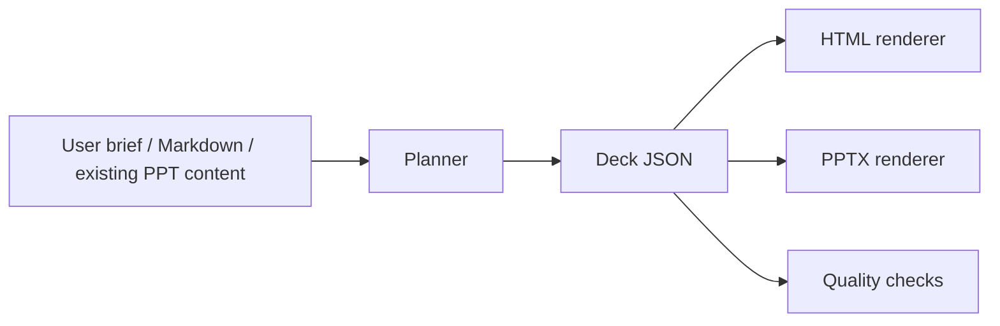

# HIT Presentation Skill System v2

This document defines the next design direction for the HIT Shenzhen HTML PPT template library after studying:

- `hugohe3/ppt-master`: native editable PowerPoint output should be a first-class target, not only screenshots.
- `op7418/guizang-ppt-skill`: a skill needs locked layouts, quality checklists, visual systems, and deterministic generation steps.
- `zarazhangrui/frontend-slides`: HTML slides should provide bold visual previews and reusable template styles, not generic deck shells.

## Product Goal

Build one presentation system with three outputs:

1. **HTML Deck**: animated, presentation-ready, opened directly in a browser.
2. **PPTX Deck**: editable PowerPoint file for users who need native delivery.
3. **Skill Workflow**: AI agents can plan, structure, lay out, and render decks from brief requirements or existing content.

The central contract is `Deck JSON`. Markdown, user briefs, extracted PPT content, HTML rendering, and PPTX rendering all pass through this structure.

## Visual Direction

### Academic

- Tone: rigorous, rational, data-driven.
- Color: HIT Blue `#005375`, cyan data glow, restrained gold lines.
- Layout: dense but ordered. Prefer grids, axes, chart panels, method maps, comparison blocks.
- Ornament: campus building contour, gear/engineering motif, data scan lines. Avoid ceremonial red.
- Motion: precise timeline sequencing, chart rise, line scan.

### Course

- Tone: project-oriented, collaborative, clear.
- Color: HIT Blue primary, blue-green and blue-orange accents.
- Layout: brighter, modular, more image/data placeholders than campaign. Prefer process boards, team cards, prototype frames, feedback charts.
- Ornament: campus windows, project boards, grouped modules.
- Motion: lighter stagger, panel slide, photo strip parallax.

### Campaign

- Tone: solemn, ceremonial, declarative.
- Color: Celebration Red `#A72126`, gold, ivory.
- Layout: strong hierarchy, large statements, profile/photo space, action plans, pledge pages.
- Ornament: banner/ribbon, flag, formal gold rules, emblem-safe ceremonial composition.
- Motion: title stamp, gold sweep, solemn reveal.

## Template Library Upgrade

Each template should expose:

- `visualSystem`: colors, fonts, brand variant, background assets, ornament rules.
- `layoutSystem`: allowed page kinds and block positions.
- `contentPolicy`: preferred density, chart/image ratio, forbidden color/logo usage.
- `renderTargets`: `html`, `pptx`.

The current 9 templates stay as the base library:

- academic: `academic-tech-dark`, `academic-data-light`, `academic-minimal`
- course: `course-bright`, `course-capsule`, `course-modern`
- campaign: `campaign-red-gold`, `campaign-formal`, `campaign-manifesto`

## Layout Library

The renderer should keep page types locked enough for quality but flexible enough for user input.

| Kind | Role | Best For |
| --- | --- | --- |
| `cover` | Opening identity | title, presenter, unit, date, hero image |
| `agenda` | Structure | 4-6 part outline |
| `transition` | Chapter break | section title and direction |
| `background` | Problem context | paragraphs, bullets, 1-2 metrics |
| `logic-chart` | Concept model | variables, mechanisms, framework nodes |
| `flow` | Process | method route, project workflow |
| `compare` | Decision | before/after, baseline/proposed |
| `data` | Evidence | charts, metrics, tables |
| `figure` | Visual argument | image plus conclusions |
| `gallery` | Multiple visuals | photos, campus, activities, prototype states |
| `timeline` | Roadmap | stages, milestones |
| `swot` | Risk/strategy | four-quadrant analysis |
| `quote` | Declaration | campaign statement, motto, key assertion |
| `summary` | Closing logic | conclusions and next steps |
| `thanks` | Q&A | contact, final brand mark |

## PPTX Strategy

Phase 1 creates editable native PPTX with:

- text boxes, metric cards, bullets, and simple image placeholders;
- template-matched colors and brand header;
- 16:9 wide slides;
- stable page kinds from Deck JSON.

Phase 2 improves PPTX fidelity:

- richer diagrams and charts;
- image cropping strategies;
- editable native charts when data is structured;
- extracting existing PPTX text/images into Deck JSON.

HTML remains the most visually expressive output. PPTX prioritizes editability and delivery compatibility.

## Quality Gate

Before shipping generated decks:

- `npm run generate` must work for Markdown and Deck JSON.
- `npm run export:pptx` must create a `.pptx` from the same content.
- `npm run verify` must pass for template inventory.
- Brand header must remain unobstructed.
- Academic/course decks should include charts, data, figures, or table placeholders in at least one third of content slides.
- Campaign decks should include photo/profile/action/pledge layouts and use ceremonial red only in campaign templates.
