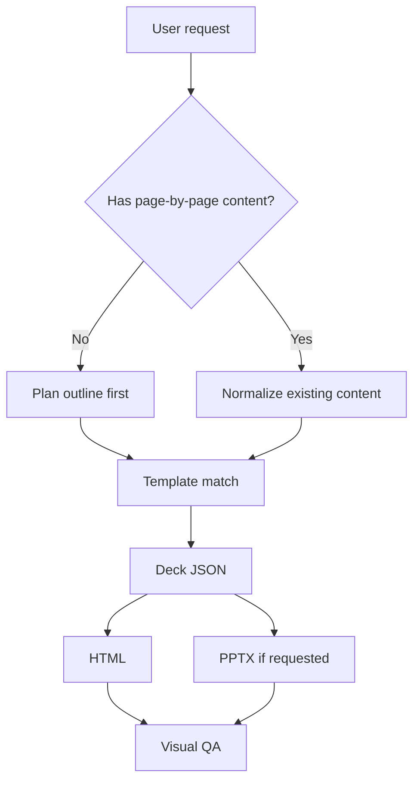

# HIT PPT Skill Workflow v2

The skill turns user intent or existing slide content into a designed presentation.

## Operating Modes

### 1. Brief To Deck

Use when the user only gives a topic, occasion, or rough demand.

1. Ask for occasion and mood if missing.
2. Match 2-3 templates from `index.json`.
3. Plan slides page by page.
4. Convert the plan into Markdown or Deck JSON.
5. Render HTML and optional PPTX.
6. Review visual density and brand compliance.

Useful commands:

```bash
npm run match -- --query "工大蓝 严谨 数据 开题报告"
npm run plan -- --brief "多模态传感数据驱动的城市交通预测开题报告" --output planned.deck.json
npm run quality -- --content planned.deck.json
npm run create -- --brief "课程小组智能制造项目汇报" --outDir generated/manufacturing
```

### 2. Existing Content To Deck

Use when the user provides Markdown, pasted slide content, images, tables, or extracted PPT text.

1. Keep the user's slide intent.
2. Normalize into Deck JSON.
3. Detect page kind for each section.
4. Pick layouts based on content type.
5. Render using the selected template.
6. Preserve images and data as explicit blocks where possible.

### 3. Existing PPT Re-layout

Future mode. Extract PPTX text/images into Deck JSON, then regenerate HTML/PPTX with the HIT visual system.

Current baseline command:

```bash
npm run import:pptx -- --input old-deck.pptx --output imported.deck.json --template academic-tech-dark
```

The importer preserves slide text and images. PPTX files generated by this project also include hidden `HIT_KIND` metadata so re-imported pages keep their intended layout kind.

## Agent Decision Tree



## Template Matching

- Academic: thesis defense, opening report, research meeting, technical report.
- Course: group presentation, project showcase, prototype report, class assignment.
- Campaign: student union, league organization, candidacy defense, formal appointment pitch.

When uncertain, present three options:

- one safest formal option;
- one more visual/commercial option;
- one minimal option.

## Deck JSON Contract

Every generated deck should contain:

```json
{
  "schemaVersion": "2.0",
  "template": "academic-tech-dark",
  "title": "Deck title",
  "meta": {
    "occasion": "论文答辩",
    "audience": "导师组",
    "mood": ["严谨", "数据驱动"]
  },
  "slides": [
    {
      "kind": "cover",
      "title": "Slide title",
      "subtitle": "Optional subtitle",
      "body": "",
      "bullets": [],
      "metrics": [],
      "images": [],
      "table": null,
      "blocks": []
    }
  ]
}
```

The generator accepts both a raw slide array and a full Deck JSON object.

## Content Planning Defaults

Academic full deck:

1. Cover
2. Agenda
3. Research background
4. Problem definition
5. Literature gap
6. Research questions
7. Method framework
8. Technical route
9. Data and experiment setting
10. Evaluation metrics
11. Main results
12. Ablation / comparison
13. Figure explanation
14. Case study
15. Robustness / limitations
16. Timeline
17. Conclusion
18. Q&A

Course full deck:

1. Cover
2. Agenda
3. Course task
4. Problem background
5. User / stakeholder
6. Team division
7. Solution route
8. Prototype / demo
9. Data or feedback
10. Result showcase
11. Reflection
12. Q&A

Campaign full deck:

1. Cover
2. Agenda
3. Personal profile
4. Motivation / original intention
5. Experience
6. Achievements
7. Problem judgment
8. Work plan
9. Key initiatives
10. Team collaboration
11. Commitment
12. Closing declaration
13. Q&A

## Quality Checklist

- Brand logo/name stays in the top header, never covered by decoration.
- Template theme color appears across content slides, not only cover and thanks.
- Data slides contain metrics, charts, or structured tables.
- Figure/gallery slides reserve real image areas.
- Campaign pages include photo-heavy layouts where appropriate.
- PPTX export remains editable for text and metric cards.

Automated quality scoring is available:

```bash
npm run quality -- --content deck.md --template academic-tech-dark
```
